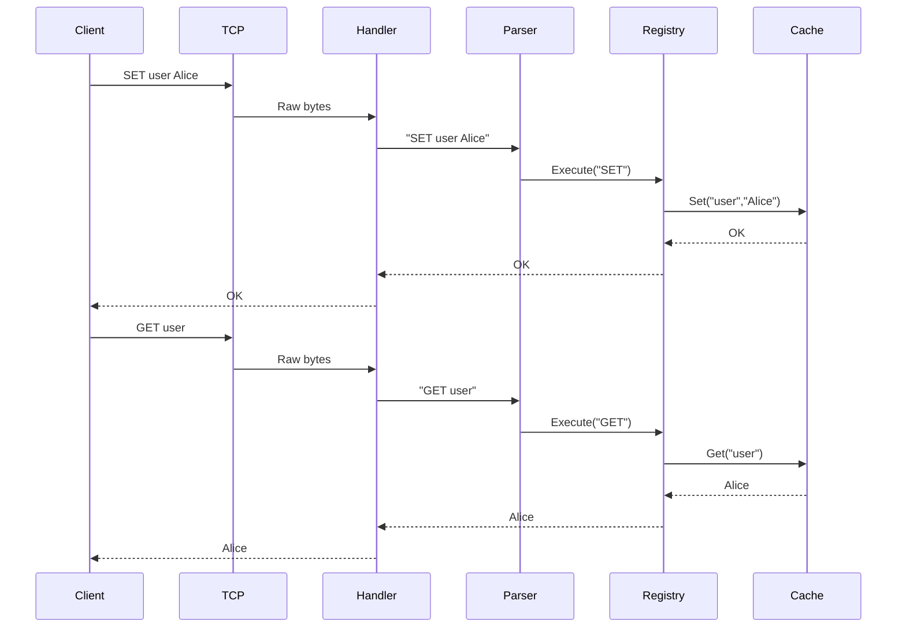
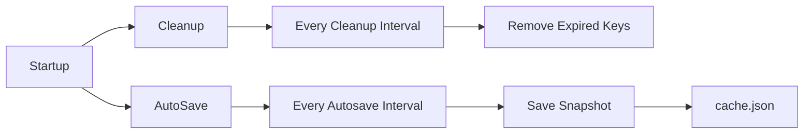
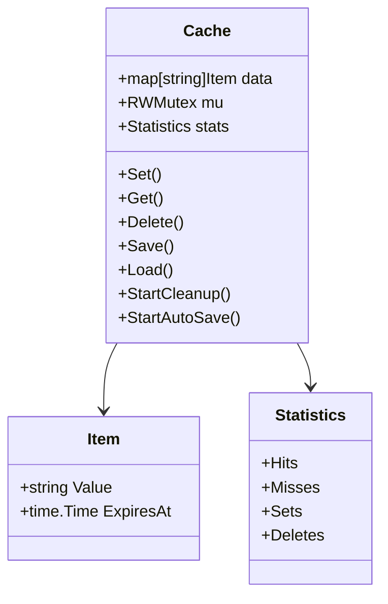
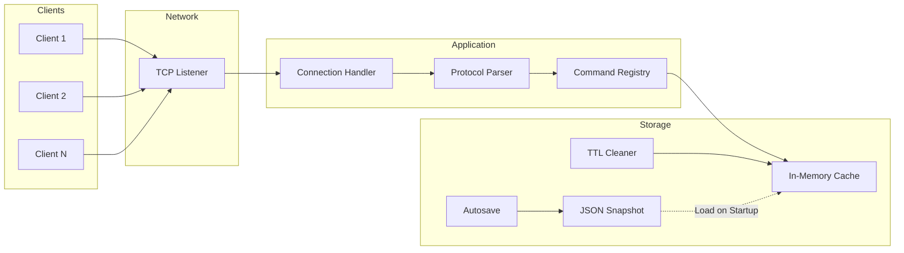

# ⚡ In-Memory TCP Cache

[](https://go.dev/)
[](#tcp-command-reference)
[](#configuration)
[](testing/README.md)
[](#license)

A lightweight Go cache server that accepts line-based TCP commands. It stores values in memory, supports TTL expiry, LRU eviction, persistence snapshots, operational statistics, and concurrent clients.

> **Tags:** `golang` · `tcp-server` · `in-memory-cache` · `lru` · `ttl` · `concurrency` · `yaml-config` · `benchmarking`

## ✨ Features

- **TCP protocol** — simple newline-delimited commands over a persistent connection.
- **Fast in-memory storage** — map-backed lookup with an LRU list.
- **Bounded capacity** — configurable `maxKeys` eviction limit.
- **TTL support** — per-key expiration plus background cleanup.
- **Persistence** — periodic JSON snapshots and reload on startup.
- **Statistics** — request, hit, miss, set, and delete counters through `INFO`.
- **Configuration** — reads `config/config.yaml` at server startup; environment variables can override selected fields.
- **Test coverage** — unit, integration, benchmark, load, and real local-TCP stress testing are documented in [`testing/`](testing/README.md).

## 🧱 Architecture

```text
TCP clients
    │
    ▼
TCP listener → connection handler → command dispatcher
                                      │
                                      ▼
                           Cache (map + LRU + mutex)
                              │       │       │
                              ▼       ▼       ▼
                           TTL cleanup  stats  JSON snapshots
```
# Request Flow Diagram


# Background Workers


# Cache Internals 


# Overall System Architecture



```text
cache/
│
├── cmd/
│   └── server/
│       └── main.go
│
├── config/
│   └── config.go
│
├── data/
│   └── cache.json
│
├── internal/
│   │
│   ├── cache/
│   │   ├── cache.go
│   │   ├── item.go
│   │   ├── cleanup.go
│   │   ├── persistence.go
│   │   └── snapshot.go
│   │
│   ├── commands/
│   │   ├── registry.go
│   │   ├── set.go
│   │   ├── get.go
│   │   ├── delete.go
│   │   └── ping.go
│   │
│   ├── handler/
│   │   └── connection.go
│   │
│   │
│   ├── statistics/
│   │
│   │
│   └── utils/
│
├── .github/
│   └── workflows/
│       └── ci.yml
│
├── Dockerfile
├── README.md
└── go.sum
```

## 🚀 Quick start

### Prerequisites

- Go 1.26.5 or compatible Go toolchain

### Start the server

Run this command from the project root (the directory containing `go.mod`):

```powershell
go run ./cmd/server
```

The server reads [`config/config.yaml`](config/config.yaml), starts listening on its configured port, and logs the bound port.

### Connect

Use any TCP client, for example `telnet`, `nc`, or an application client:

```text
SET user Alice
GET user
DELETE user
GET user
```

Expected responses:

```text
OK
Alice
OK
NOT_FOUND
```

## ⚙️ Configuration

Default configuration is stored in [`config/config.yaml`](config/config.yaml):

```yaml
port: 8080
maxKeys: 1000
cleanupInterval: 1s
autosaveInterval: 30s
dataFile: data/cache.json
```

| Field | Description |
| --- | --- |
| `port` | TCP listening port. The server binds to all local interfaces (`:<port>`). |
| `maxKeys` | Maximum in-memory key count before LRU eviction. Must be greater than zero. |
| `cleanupInterval` | Interval for removing expired keys; uses Go duration syntax. |
| `autosaveInterval` | Interval for writing the snapshot; uses Go duration syntax. |
| `dataFile` | JSON snapshot location. Its parent directory is created automatically. |

The parser supports this flat `key: value` YAML format. An invalid, missing, or unknown setting stops startup with a clear error instead of silently using the wrong configuration.

### Environment overrides

These environment variables override their YAML counterparts:

| Variable | Overrides |
| --- | --- |
| `CONFIG_FILE` | Location of the YAML configuration file. |
| `PORT` | `port` |
| `DATA_FILE` | `dataFile` |
| `CLEANUP_INTERVAL` | `cleanupInterval` |
| `AUTOSAVE_INTERVAL` | `autosaveInterval` |

Example:

```powershell
$env:PORT='9090'
go run ./cmd/server
```

## 📡 TCP command reference

Send one command per line. Command names are case-insensitive; keys and values cannot contain spaces.

| Command | Description | Example | Response |
| --- | --- | --- | --- |
| `PING` | Checks whether the server is responsive. | `PING` | `PONG` |
| `SET <key> <value> [ttl_seconds]` | Stores a value, optionally with a TTL in seconds. | `SET session active 60` | `OK` |
| `GET <key>` | Retrieves a value. | `GET session` | value or `NOT_FOUND` |
| `DELETE <key>` | Removes a key if it exists. | `DELETE session` | `OK` |
| `INFO` | Shows cache counters. | `INFO` | `Requests=… Hits=… Misses=… Sets=… Deletes=…` |

Unknown commands return `ERROR unknown command`. Invalid command arguments return an `ERROR usage: ...` response.

## 🧪 Testing

The normal suite covers cache behavior, persistence, commands, protocol handling, and YAML configuration:

```powershell
go test ./...
```

Performance and load benchmarks:

```powershell
go test -run '^$' -bench '^(BenchmarkSetOverwrite|BenchmarkGetHit|BenchmarkMixedParallel)$' -benchtime=3s -benchmem -count=3 ./internal/cache
go test -run '^$' -bench '^BenchmarkProtocolRoundTripParallel$' -benchtime=3s -benchmem -count=3 ./internal/handler
```

Opt-in real local-TCP stress test:

```powershell
$env:RUN_STRESS='1'; go test -run '^TestTCPStress$' -v ./internal/handler
```

The verified stress run used 128 simultaneous TCP clients and completed 2.56 million commands at approximately 216K commands/second with no protocol errors. Detailed documentation is available in the [`testing/`](testing/README.md) folder, and the full figures are in [`PERFORMANCE_TEST_REPORT.md`](PERFORMANCE_TEST_REPORT.md).

> Race detection has not been completed because the local Windows C compiler does not support 64-bit mode. After installing a supported compiler, run `go test -race ./...`.

## 📁 Project layout

```text
cmd/server/          application entry point
config/              YAML config loader and configuration
internal/cache/      storage, TTL cleanup, LRU behavior, persistence
internal/commands/   TCP command implementations
internal/handler/    connection handling, load and stress tests
internal/utils/      request dispatching
testing/             test guides by testing type
data/                runtime snapshots
```

## 📊 Measured local capacity

| Scenario | Result |
| --- | ---: |
| Cache GET hit | ~10.4M ops/s |
| Concurrent cache mix (75% GET / 25% SET) | ~4.53M ops/s |
| Protocol load benchmark | ~1.13M commands/s |
| Real local-TCP stress test | ~216K commands/s |

These are local-machine measurements, not production network guarantees. Review [`PERFORMANCE_TEST_REPORT.md`](PERFORMANCE_TEST_REPORT.md) before setting deployment capacity limits.

## 📄 License

No license file is currently included. Add one before distributing or using the project as an open-source dependency.